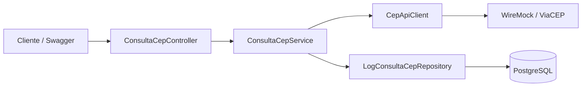

# Petshop CEP API

API REST para consulta de CEP em um provider externo, com auditoria persistida em PostgreSQL. O projeto foi desenvolvido para demonstrar uma solução simples, testável e pronta para evolução, aplicando conceitos básicos de SOLID e integração HTTP simulada por WireMock.

## Requisitos do desafio

| Requisito | Como foi atendido |
|---|---|
| Desenho de solução | Diagrama de arquitetura e fluxo documentados neste README. |
| Busca de CEP em API externa | `ViaCepApiClient` usa `RestClient` para consultar o provider configurado. |
| API mockada | WireMock é usado no Docker Compose e nos testes automatizados. |
| Logs em banco | Cada consulta válida gera um registro em PostgreSQL com horário, status, resposta ou erro. |
| Conceitos básicos de SOLID | Camadas separadas, interface para o provider e dependências injetadas. |

## Arquitetura



### Fluxo principal

1. O cliente chama `GET /api/ceps/{cep}`.
2. O controller delega a operação para `ConsultaCepService`.
3. O service valida o formato do CEP e chama o provider externo por meio da abstração `CepApiClient`.
4. A resposta é interpretada, devolvida ao cliente e registrada no PostgreSQL.
5. CEP inexistente, indisponibilidade externa e erros inesperados são convertidos em respostas HTTP padronizadas com `ProblemDetail`.

A API aceita CEP com ou sem hífen. O valor informado é mantido para a consulta externa e o CEP é armazenado no banco sem hífen, com oito dígitos, facilitando auditoria e futuras consultas por CEP.

## Tecnologias

- Java 17
- Spring Boot
- Spring Web e `RestClient`
- Spring Data JPA
- PostgreSQL
- Flyway
- WireMock
- Docker Compose
- Springdoc OpenAPI / Swagger UI
- Spring Boot Actuator
- JUnit 5, Mockito e Testcontainers
- Lombok

## SOLID aplicado

- **Single Responsibility:** o controller trata HTTP; o service coordena regra de negócio e auditoria; o client encapsula a integração; o repository persiste logs.
- **Dependency Inversion:** `ConsultaCepService` depende de `CepApiClient`, uma abstração do provider externo, em vez de depender diretamente de `RestClient`.
- **Open/Closed:** um novo provider compatível pode ser criado implementando `CepApiClient`, sem alterar controller ou regra principal.
- **Testabilidade:** regras são testadas com mocks; HTTP externo é testado com WireMock; fluxo completo usa PostgreSQL isolado por Testcontainers.

## Pré-requisitos

- Java 17 ou superior
- Docker Desktop / Docker Engine em execução
- Maven Wrapper incluído no repositório

## Como executar localmente

### 1. Subir PostgreSQL e WireMock

Na raiz do projeto:

```bash
docker compose up -d
```

Serviços disponíveis localmente:

| Serviço | Endereço |
|---|---|
| PostgreSQL | `127.0.0.1:5432` |
| WireMock | `http://127.0.0.1:8082` |

### 2. Informar a URL do provider

`CEP_API_BASE_URL` é obrigatória para a aplicação iniciar. Para usar o WireMock local:

**PowerShell**

```powershell
$env:CEP_API_BASE_URL = "http://localhost:8082"
.\mvnw.cmd spring-boot:run
```

**Prompt de Comando**

```bat
set CEP_API_BASE_URL=http://localhost:8082
mvnw.cmd spring-boot:run
```

**Linux/macOS**

```bash
export CEP_API_BASE_URL=http://localhost:8082
./mvnw spring-boot:run
```

> O arquivo `.env` é lido pelo Docker Compose. Para iniciar a aplicação pelo Maven ou pela IDE, configure `CEP_API_BASE_URL` no terminal ou na configuração de execução.

Para usar o ViaCEP real, configure:

```text
CEP_API_BASE_URL=https://viacep.com.br
```

### 3. Acessos locais

| Recurso | URL |
|---|---|
| API | `http://localhost:8080` |
| Swagger UI | `http://localhost:8080/swagger-ui/index.html` |
| Health check | `http://127.0.0.1:8081/actuator/health` |
| Informações da aplicação | `http://127.0.0.1:8081/actuator/info` |

## Endpoint

### Consultar CEP

```http
GET /api/ceps/{cep}
```

Exemplos válidos:

```bash
curl -i http://localhost:8080/api/ceps/11320180
curl -i http://localhost:8080/api/ceps/11320-180
```

## Contrato de respostas

| Situação | Status | Código |
|---|---:|---|
| CEP encontrado | `200 OK` | — |
| CEP inválido | `400 Bad Request` | `CEP_INVALIDO` |
| CEP não encontrado | `404 Not Found` | `CEP_NAO_ENCONTRADO` |
| Provider indisponível | `503 Service Unavailable` | `CEP_PROVIDER_UNAVAILABLE` |
| Erro inesperado | `500 Internal Server Error` | — |

### Sucesso — `200 OK`

```json
{
  "cep": "11320-180",
  "logradouro": "Rua Saldanha da Gama",
  "bairro": "Itararé",
  "localidade": "São Vicente",
  "uf": "SP",
  "ddd": "13",
  "erro": false
}
```

### CEP inválido — `400 Bad Request`

```json
{
  "type": "urn:petshop:cep-errors:cep-invalido",
  "title": "CEP inválido",
  "status": 400,
  "detail": "O CEP deve possuir exatamente 8 dígitos.",
  "instance": "/api/ceps/123",
  "codigo": "CEP_INVALIDO"
}
```

### CEP não encontrado — `404 Not Found`

```json
{
  "type": "urn:petshop:cep-errors:cep-nao-encontrado",
  "title": "CEP não encontrado",
  "status": 404,
  "detail": "CEP 00000000 não encontrado.",
  "instance": "/api/ceps/00000000",
  "codigo": "CEP_NAO_ENCONTRADO"
}
```

O provider pode devolver `200 OK` com `{"erro": true}` para um CEP com formato válido, mas inexistente. A API traduz esse contrato externo para `404 Not Found`.

### Falha do provider — `503 Service Unavailable`

```json
{
  "type": "urn:petshop:cep-errors:servidor-indisponivel",
  "title": "Serviço de CEP indisponivel no momento, tente mais tarde.",
  "status": 503,
  "detail": "Não foi possível consultar o serviço externo de CEP.",
  "instance": "/api/ceps/99999-999",
  "codigo": "CEP_PROVIDER_UNAVAILABLE"
}
```

### Erro inesperado — `500 Internal Server Error`

```json
{
  "type": "urn:petshop:cep-errors:internal-server-error",
  "title": "Erro interno do servidor",
  "status": 500,
  "detail": "Ocorreu um erro interno. Tente novamente mais tarde.",
  "instance": "/api/ceps/11320-180"
}
```

## Auditoria das consultas

A migration Flyway cria a tabela `log_consulta_cep`.

| Campo | Descrição |
|---|---|
| `id` | Identificador UUID do log |
| `cep` | CEP normalizado com oito dígitos |
| `dh_consulta` | Data e hora em UTC |
| `status` | Resultado da consulta |
| `nr_status_http` | Status recebido do provider, quando disponível |
| `json_resposta_api` | Resposta JSON do provider em consultas concluídas |
| `ds_erro` | Descrição do erro de integração, quando houver |

Status persistidos:

```text
SUCESSO
CEP_NAO_ENCONTRADO
ERRO_API_EXTERNA
```

A aplicação grava um único log para cada consulta válida, inclusive quando o CEP não existe ou quando o provider responde com erro.

## WireMock

O WireMock permite executar e testar a aplicação sem depender da disponibilidade do ViaCEP.

| CEP | Resposta do WireMock | Resultado da API |
|---|---|---|
| `11320180` | Endereço de São Vicente/SP | `200 OK` |
| `00000000` | `{ "erro": true }` | `404 Not Found` |
| `99999999` | `503 Service Unavailable` | `503 Service Unavailable` |

Os stubs ficam em:

```text
src/test/resources/wiremock/consulta-cep
```

## Testes automatizados

Execute todos os testes com Docker em execução:

**Windows**

```bat
.\mvnw.cmd clean test
```

**Linux/macOS**

```bash
./mvnw clean test
```

| Classe | Objetivo |
|---|---|
| `ConsultaCepControllerTest` | Contrato HTTP, validações e respostas de erro do controller |
| `ConsultaCepServiceTest` | Regras de negócio, persistência de log e tratamento de exceções |
| `ViaCepApiClientWireMockTest` | Integração HTTP do client com WireMock |
| `ConsultaCepIntegrationTest` | Fluxo completo: Controller → Service → Client → WireMock + PostgreSQL temporário |

O teste de integração usa `MockMvc`, WireMock e Testcontainers. Ele valida que cada cenário executa uma chamada externa e persiste exatamente um registro de auditoria.

## Decisões técnicas e qualidade de engenharia

- **Configuração externa obrigatória:** a URL do provider não é fixa no código; `CEP_API_BASE_URL` é obrigatória.
- **Timeouts explícitos:** conexão em 2 segundos e leitura em 3 segundos, reduzindo risco de threads bloqueadas por uma integração indisponível.
- **Sem retry automático:** uma consulta pode gerar auditoria; repetir chamadas externas sem estratégia de idempotência pode duplicar logs e carga no provider. Uma política de retry deve ser introduzida apenas com backoff, observabilidade e regra clara de persistência.
- **Schema controlado:** Flyway versiona o banco e Hibernate apenas valida o mapeamento.
- **Tempo testável:** `Clock` é injetado no service, permitindo testes determinísticos de data e hora.
- **Erros consistentes:** `ProblemDetail` padroniza `type`, `title`, `status`, `detail`, `instance` e código de domínio.
- **Isolamento de teste:** Testcontainers evita dependência do banco local para validar o fluxo ponta a ponta.
- **Operação local protegida:** PostgreSQL, WireMock e Actuator ficam vinculados ao loopback durante o desenvolvimento.

## Próximos passos para produção

Os itens abaixo não são necessários para o desafio, mas mostram como a solução pode evoluir com segurança:

1. **CI no GitHub Actions:** executar `./mvnw clean test` em cada push e pull request.
2. **Métricas e alertas:** publicar contadores de sucesso, CEP não encontrado, falhas do provider e tempo da chamada externa.
3. **Retenção de auditoria:** definir política de expurgo ou arquivamento de logs antigos, conforme necessidade de negócio e privacidade.
4. **Rate limiting e autenticação:** proteger o endpoint caso a API seja exposta publicamente.
5. **Retry resiliente:** somente para falhas transitórias, com backoff e estratégia que garanta um único log final por solicitação.
6. **Observabilidade distribuída:** adicionar trace ID propagado entre logs e chamadas externas quando houver mais de um serviço.
